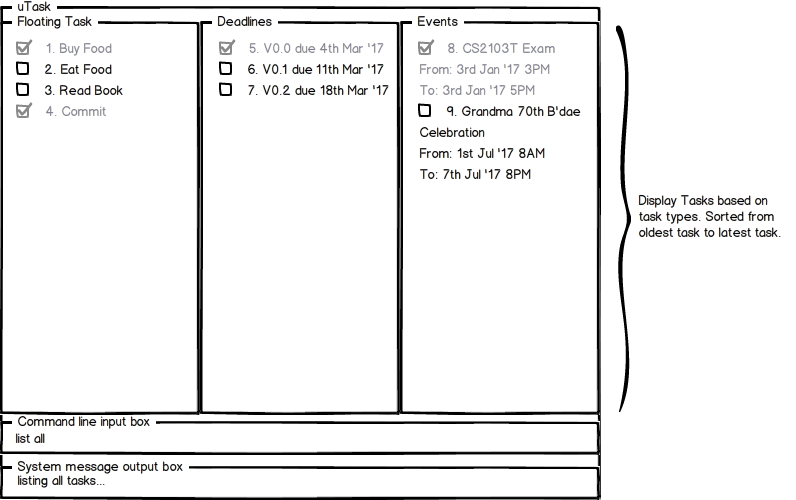

# Address Book (Level 4)

 

* This is a desktop Task manager application. It has a GUI but most of the user interactions happen using
  a CLI (Command Line Interface).
* It is a Java sample application intended for people interested in using a Command line based task scheduler program.
* It is **written in OOP fashion**. It provides a **reasonably well-written** code example that is
  **significantly bigger** (around 6 KLoC)than what students usually write in beginner-level SE modules.
* What's different from [level 3](https://github.com/se-edu/addressbook-level3):
    * A more sophisticated GUI that includes a list panel and an in-built Browser.
    * More test cases, including automated GUI testing.
    * Support for *Build Automation* using Gradle and for *Continuous Integration* using Travis CI.

#### Site Map
* [User Guide](docs/UserGuide.md)
* [Developer Guide](docs/DeveloperGuide.md)
* [Learning Outcomes](docs/LearningOutcomes.md)
* [About Us](docs/AboutUs.md)
* [Contact Us](docs/ContactUs.md)

#### Acknowledgements

* Some parts of this sample application were inspired by the excellent
  [Java FX tutorial](http://code.makery.ch/library/javafx-8-tutorial/) by *Marco Jakob*.

#### Licence : [MIT](LICENSE)
