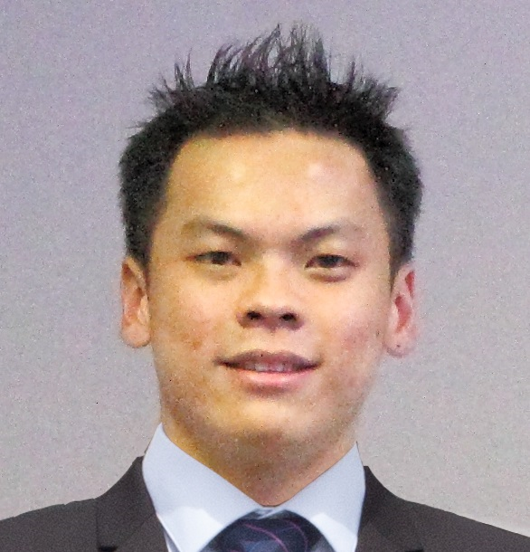
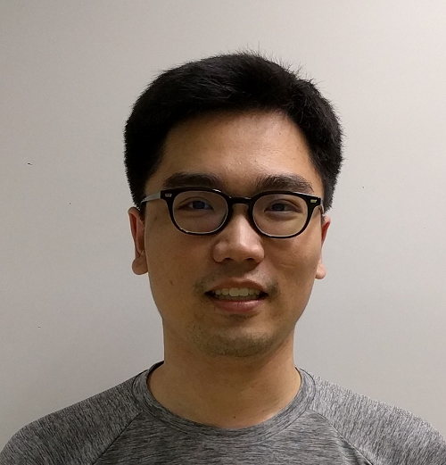

# About Us

We are a team based in the [School of Computing, National University of Singapore](http://www.comp.nus.edu.sg).

## Project Team

#### [Liu Jiahao](http://github.com/liujiahaocs)
 
Role: Team Lead 
Responsibilities: Deliverables and deadlines, Integration, Git expert
In charge of: Model

-----

#### [Tan Jian Hong, Denver](http://github.com/deltango)
 
Role: Developer  
Responsibilities: Scheduling and tracking, Eclipse expert
In charge of: Storage, GUI

-----

#### [Teng Yong Hao](http://github.com/yong24s)
 
Role: Developer  
Responsibilities: Code quality, Testing, SourceTree expert
In charge of: Architecture, GUI

 -----
