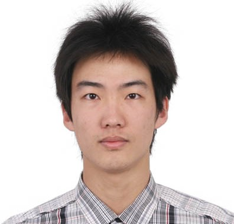

# About Us

We are a team based in the [School of Computing, National University of Singapore](http://www.comp.nus.edu.sg).

## Project Team

#### [Liu Jiahao](http://github.com/liujiahaocs)
 
Role: Team Lead 
Responsibilities: Deliverables and deadlines, Integration, Git expert  

* Components in charge of: Logic, Model, Storage
* Features implemented:
  - Delete, multiple delete commands
  - Find command
  - Alias/Unalias/List Alias commands
  - Relocate command
  - Sort commands and Sorting comparators
* Code written:
  - [Functional Codes](../collated/main/A0138493W.md)
  - [Test Codes](../collated/test/A0138493W.md)
  - [Documentation](../collated/docs/A0138493W.md)
* Other major contributions:
  - Contribute to the Big refactor from Addressbook 4 to UTask
  - Integrated tests
  - GitHub repository maintainer (set up Travis, issue tracker maintainence, etc)
  - Chase deadline for weekly milestone (close milestone, generate jar file)
  - Review every PR before merge
  - Prepare SampleData and TestScript for testing

-----

#### [Tan Jian Hong, Denver](http://github.com/deltango)
 
Role: Developer  
Responsibilities: Testing, Scheduling and tracking, Eclipse expert  

* Components in charge of: Logic, Model, Storage
* Features implemented:
  - Update command
  - Done and Undone command
  - Createtag command
  - Updatetag command
  - Deletetag command
* Code written:
  - [Functional Codes](../collated/main/A0138423J.md)
  - [Test Codes](../collated/test/A0138423J.md)
  - [Documentation](../collated/docs/A0138423J.md)
* Other major contributions:
  - Contribute to the Big refactor from Addressbook 4 to UTask
  - Set up GitHub repository (Link and connect to Appveyor, Coveralls and Codacy)
  - Adapting xml storage file to UTask requirements
  - Flexible upgrade and downgrade of Task Types
  - Tag Color Customization
  - Cascade update and delete to tasks triggered during tag-related commands
  - Appraise peers' PR
  - Unit tests

-----

#### [Teng Yong Hao](http://github.com/yong24s)
 
Role: Developer  
Responsibilities: Code quality, Testing, SourceTree expert  

* Components in charge of: User Interface, Logic, Model
* Features implemented:
  - User Interface designs (FXML, CSS, Java [Dynamic Population and Binding])
  - User Interface helpers (ListHelper, ListViewHelper, FilterListHelper, TagColorHelper)
  - User Interface behaviours (FindOverlay Sort, Dialogs, Events)
  - Undo/Redo commands
  - Create commands
  - SortInFindCommandParser (Dynamic) Command
  - SuggestionHelper
  - DateUtil
  - DelayedExecution (Ensure certain logic to wait for UI animation to end, to avoid race conditon)
  
* Code written:
  - [Functional Codes](../collated/main/A0139996A.md)
  - [Test Codes](../collated/test/A0139996A.md)
  - [Documentation](../collated/docs/A0139996A.md)
* Other major contributions:
  - Contribute to the Big refactor from Addressbook 4 to UTask
  - Architecture 
  - Ensure UTask has good UXUI
  - Overhaul User Interface
  - Ensure libraries, such as JFoenix, Natty are suitable in UTask
  - Communicates with team to ensure everyone uses good OOP in UTask
  - Creates Building block for team
  - GUI tests
  - Open GitHub issues for foreseen problems
  - Review PR for Code Quality feedback
 -----
