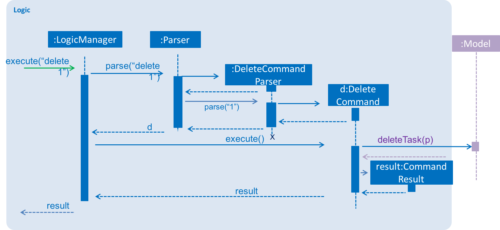
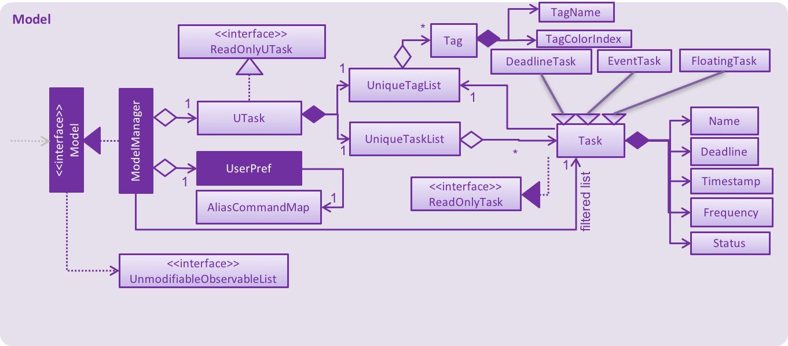

# µTask - Developer Guide

By : `Team W13-B1`  &nbsp;&nbsp;&nbsp;&nbsp; Since: `Jan 2017`  &nbsp;&nbsp;&nbsp;&nbsp; Licence: `MIT`

---

## Table of contents

1. [Setting Up](#setting-up)
2. [Design](#design)
3. [Implementation](#implementation)
4. [Testing](#testing)
5. [Dev Ops](#dev-ops)

* [Appendix A: User Stories](#appendix-a--user-stories)
* [Appendix B: Use Cases](#appendix-b--use-cases)
* [Appendix C: Non Functional Requirements](#appendix-c--non-functional-requirements)
* [Appendix D: Glossary](#appendix-d--glossary)
* [Appendix E : Product Survey](#appendix-e--product-survey)

## Introduction

uTask is a task manager for advanced users to manage their daily tasks through keyboard commands. It is
a java desktop application has a GUI implemented with JavaFX.

This Developer Guide provides general information about setting up and design for uTask. It focuses
primarily on setting up, design, implementation, testing and DevOps. It will help developers to understand
how uTask works and how to further improve it. The guide is in top-down manner, so you can look at the
overall picture of uTask and then breaking down the various components in each sub-section. Each sub-section
is self-contained, you can easily set up and start contributing by following the guide.

## 1. Setting up

### 1.1. Prerequisites

1. **JDK `1.8.0_60`**  or later 

    > Having any Java 8 version is not enough.  
    This app will not work with earlier versions of Java 8.

2. **Eclipse** IDE
3. **e(fx)clipse** plugin for Eclipse (Do the steps 2 onwards given in
   [this page](http://www.eclipse.org/efxclipse/install.html#for-the-ambitious))
4. **Buildship Gradle Integration** plugin from the Eclipse Marketplace
5. **Checkstyle Plug-in** plugin from the Eclipse Marketplace

### 1.2. Importing the project into Eclipse

1. Fork this repo, and clone the fork to your computer
2. Open Eclipse (Note: Ensure you have installed the **e(fx)clipse** and **buildship** plugins as given
   in the prerequisites above)
3. Click `File` > `Import`
4. Click `Gradle` > `Gradle Project` > `Next` > `Next`
5. Click `Browse`, then locate the project's directory
6. Click `Finish`

  > * If you are asked whether to 'keep' or 'overwrite' config files, choose to 'keep'.
  > * Depending on your connection speed and server load, it can even take up to 30 minutes for the set up to finish
      (This is because Gradle downloads library files from servers during the project set up process)
  > * If Eclipse auto-changed any settings files during the import process, you can discard those changes.

### 1.3. Configuring Checkstyle
1. Click `Project` -> `Properties` -> `Checkstyle` -> `Local Check Configurations` -> `New...`
2. Choose `External Configuration File` under `Type`
3. Enter an arbitrary configuration name e.g. addressbook
4. Import checkstyle configuration file found at `config/checkstyle/checkstyle.xml`
5. Click OK once, go to the `Main` tab, use the newly imported check configuration.
6. Tick and select `files from packages`, click `Change...`, and select the `resources` package
7. Click OK twice. Rebuild project if prompted

> Note to click on the `files from packages` text after ticking in order to enable the `Change...` button

### 1.4. Troubleshooting project setup

**Problem: Eclipse reports compile errors after new commits are pulled from Git**

* Reason: Eclipse fails to recognize new files that appeared due to the Git pull.
* Solution: Refresh the project in Eclipse: 
  Right click on the project (in Eclipse package explorer), choose `Gradle` -> `Refresh Gradle Project`.

**Problem: Eclipse reports some required libraries missing**

* Reason: Required libraries may not have been downloaded during the project import.
* Solution: [Run tests using Gradle](UsingGradle.md) once (to refresh the libraries).

## 2. Design

### 2.1. Architecture

 
_Figure 2.1.1 : Architecture Diagram_

The **_Architecture Diagram_** given above explains the high-level design of the App.
Given below is a quick overview of each component.

> Tip: The `.pptx` files used to create diagrams in this document can be found in the [diagrams](diagrams/) folder.
> To update a diagram, modify the diagram in the pptx file, select the objects of the diagram, and choose `Save as picture`.

`Main` has only one class called [`MainApp`](../src/main/java/utask/MainApp.java). It is responsible for,

* At app launch: Initializes the components in the correct sequence, and connects them up with each other.
* At shut down: Shuts down the components and invokes cleanup method where necessary.

[**`Commons`**](#common-classes) represents a collection of classes used by multiple other components.
Two of those classes play important roles at the architecture level.

* `EventsCenter` : This class (written using [Google's Event Bus library](https://github.com/google/guava/wiki/EventBusExplained))
  is used by components to communicate with other components using events (i.e. a form of _Event Driven_ design)
* `LogsCenter` : Used by many classes to write log messages to the App's log file.

The rest of the App consists of four components.

* [**`UI`**](#ui-component) : The UI of the App.
* [**`Logic`**](#logic-component) : The command executor.
* [**`Model`**](#model-component) : Holds the data of the App in-memory.
* [**`Storage`**](#storage-component) : Reads data from, and writes data to, the hard disk.

Each of the four components

* Defines its _API_ in an `interface` with the same name as the Component.
* Exposes its functionality using a `{Component Name}Manager` class.

For example, the `Logic` component (see the class diagram given below) defines it's API in the `Logic.java`
interface and exposes its functionality using the `LogicManager.java` class. 
 
_Figure 2.1.2 : Class Diagram of the Logic Component_

#### Events-Driven nature of the design

The _Sequence Diagram_ below shows how the components interact for the scenario where the user issues the
command `delete 1`.

 
_Figure 2.1.3a : Component interactions for `delete 1` command (part 1)_

>Note how the `Model` simply raises a `UTaskChangedEvent` when the UTask data are changed,
 instead of asking the `Storage` to save the updates to the hard disk.

The diagram below shows how the `EventsCenter` reacts to that event, which eventually results in the updates
being saved to the hard disk and the status bar of the UI being updated to reflect the 'Last Updated' time.  
 
_Figure 2.1.3b : Component interactions for `delete 1` command (part 2)_

> Note how the event is propagated through the `EventsCenter` to the `Storage` and `UI` without `Model` having
  to be coupled to either of them. This is an example of how this Event Driven approach helps us reduce direct
  coupling between components.

The sections below give more details of each component.

### 2.2. UI component

Author: Team-uTask

 
_Figure 2.2.1 : Structure of the UI Component_

**API** : [`Ui.java`](../src/main/java/utask/ui/Ui.java)

The UI consists of a `MainWindow` that is made up of parts e.g.`CommandBox`, `ResultDisplay`, `TaskListPanel`,
`StatusBarFooter`, `BrowserPanel` etc. All these, including the `MainWindow`, inherit from the abstract `UiPart` class.

The `UI` component uses JavaFx UI framework. The layout of these UI parts are defined in matching `.fxml` files
 that are in the `src/main/resources/view` folder. 
 For example, the layout of the [`MainWindow`](../src/main/java/utask/ui/MainWindow.java) is specified in
 [`MainWindow.fxml`](../src/main/resources/view/MainWindow.fxml)

The `UI` component:

* Executes user commands using the `Logic` component.
* Binds itself to some data in the `Model` so that the UI can auto-update when data in the `Model` change.
* Responds to events raised from various parts of the App and updates the UI accordingly.

### 2.3. Logic component

Author: Team-uTask

 
_Figure 2.3.1 : Structure of the Logic Component_

**API** : [`Logic.java`](../src/main/java/utask/logic/Logic.java)

1. `Logic` uses the `Parser` class to parse the user command.
2. This results in a `Command` object which is executed by the `LogicManager`.
3. The command execution can affect the `Model` (e.g. adding a task) and/or raise events.
4. The result of the command execution is encapsulated as a `CommandResult` object which is passed back to the `Ui`.

Given below is the Sequence Diagram for interactions within the `Logic` component for the `execute("delete 1")`
 API call. 
 
_Figure 2.3.1 : Interactions Inside the Logic Component for the `delete 1` Command_

### 2.4. Model component

Author: Team-uTask

 
_Figure 2.4.1 : Structure of the Model Component_

**API** : [`Model.java`](../src/main/java/utask/model/Model.java)

The `Model`:

* stores a `UserPref` object that represents the user's preferences.
* stores the UTask data.
* exposes a `UnmodifiableObservableList<ReadOnlyTask>` that can be 'observed' e.g. the UI can be bound to this list
  so that the UI automatically updates when the data in the list change.
* does not depend on any of the other three components.

### 2.5. Storage component

Author: Team-uTask

 
_Figure 2.5.1 : Structure of the Storage Component_

**API** : [`Storage.java`](../src/main/java/utask/storage/Storage.java)

The `Storage` component:

* can save `UserPref` objects in json format and read it back.
* can save the Address Book data in xml format and read it back.

### 2.6. Common classes

Classes used by multiple components are in the `utask.commons` package.

## 3. Implementation

### 3.1. Logging

We are using `java.util.logging` package for logging. The `LogsCenter` class is used to manage the logging levels
and logging destinations.

* The logging level can be controlled using the `logLevel` setting in the configuration file
  (See [Configuration](#configuration))
* The `Logger` for a class can be obtained using `LogsCenter.getLogger(Class)` which will log messages according to
  the specified logging level
* Currently log messages are output through: `Console` and to a `.log` file.

**Logging Levels**

* `SEVERE` : Critical problem detected which may possibly cause the termination of the application
* `WARNING` : Can continue, but with caution
* `INFO` : Information showing the noteworthy actions by the App
* `FINE` : Details that is not usually noteworthy but may be useful in debugging
  e.g. print the actual list instead of just its size

### 3.2. Configuration

Certain properties of the application can be controlled (e.g App name, logging level) through the configuration file
(default: `config.json`):

## 4. Testing

Tests can be found in the `./src/test/java` folder.

**In Eclipse**:

* To run all tests, right-click on the `src/test/java` folder and choose
  `Run as` > `JUnit Test`
* To run a subset of tests, you can right-click on a test package, test class, or a test and choose
  to run as a JUnit test.

**Using Gradle**:

* See [UsingGradle.md](UsingGradle.md) for how to run tests using Gradle.

We have two types of tests:

1. **GUI Tests** - These are _System Tests_ that test the entire App by simulating user actions on the GUI.
   These are in the `guitests` package.

2. **Non-GUI Tests** - These are tests not involving the GUI. They include,
   1. _Unit tests_ targeting the lowest level methods/classes.  
      e.g. `utask.commons.UrlUtilTest`
   2. _Integration tests_ that are checking the integration of multiple code units
     (those code units are assumed to be working). 
      e.g. `utask.storage.StorageManagerTest`
   3. Hybrids of unit and integration tests. These test are checking multiple code units as well as
      how the are connected together. 
      e.g. `utask.logic.LogicManagerTest`

#### Headless GUI Testing
Thanks to the [TestFX](https://github.com/TestFX/TestFX) library we use,
 our GUI tests can be run in the _headless_ mode.
 In the headless mode, GUI tests do not show up on the screen.
 That means the developer can do other things on the Computer while the tests are running. 
 See [UsingGradle.md](UsingGradle.md#running-tests) to learn how to run tests in headless mode.

### 4.1. Troubleshooting tests

 **Problem: Tests fail because NullPointException when AssertionError is expected**

 * Reason: Assertions are not enabled for JUnit tests.
   This can happen if you are not using a recent Eclipse version (i.e. _Neon_ or later)
 * Solution: Enable assertions in JUnit tests as described
   [here](http://stackoverflow.com/questions/2522897/eclipse-junit-ea-vm-option).  
   Delete run configurations created when you ran tests earlier.

## 5. Dev Ops

### 5.1. Build Automation

See [UsingGradle.md](UsingGradle.md) to learn how to use Gradle for build automation.

### 5.2. Continuous Integration

We use [Travis CI](https://travis-ci.org/) and [AppVeyor](https://www.appveyor.com/) to perform _Continuous Integration_ on our projects.
See [UsingTravis.md](UsingTravis.md) and [UsingAppVeyor.md](UsingAppVeyor.md) for more details.

### 5.3. Publishing Documentation

See [UsingGithubPages.md](UsingGithubPages.md) to learn how to use GitHub Pages to publish documentation to the
project site.

### 5.4. Making a Release

Here are the steps to create a new release.

 1. Generate a JAR file [using Gradle](UsingGradle.md#creating-the-jar-file).
 2. Tag the repo with the version number. e.g. `v0.1`
 2. [Create a new release using GitHub](https://help.github.com/articles/creating-releases/)
    and upload the JAR file you created.

### 5.5. Converting Documentation to PDF format

We use [Google Chrome](https://www.google.com/chrome/browser/desktop/) for converting documentation to PDF format,
as Chrome's PDF engine preserves hyperlinks used in webpages.

Here are the steps to convert the project documentation files to PDF format.

 1. Make sure you have set up GitHub Pages as described in [UsingGithubPages.md](UsingGithubPages.md#setting-up).
 1. Using Chrome, go to the [GitHub Pages version](UsingGithubPages.md#viewing-the-project-site) of the
    documentation file.  
    e.g. For [UserGuide.md](UserGuide.md), the URL will be `https://github.com/CS2103JAN2017-W13-B1/main/blob/master/docs/UserGuide.md`.
 1. Click on the `Print` option in Chrome's menu.
 1. Set the destination to `Save as PDF`, then click `Save` to save a copy of the file in PDF format.  
    For best results, use the settings indicated in the screenshot below.  
     
    _Figure 5.4.1 : Saving documentation as PDF files in Chrome_

### 5.6. Managing Dependencies

A project often depends on third-party libraries. For example, Address Book depends on the
[Jackson library](http://wiki.fasterxml.com/JacksonHome) for XML parsing. Managing these _dependencies_
can be automated using Gradle. For example, Gradle can download the dependencies automatically, which
is better than these alternatives. 
a. Include those libraries in the repo (this bloats the repo size) 
b. Require developers to download those libraries manually (this creates extra work for developers) 

## Appendix A : User Stories

Priorities: High (must have) - `* * *`, Medium (nice to have)  - `* *`,  Low (unlikely to have) - `*`

Priority | As a ... | I want to ... | So that I can...
-------- | :-------- | :--------- | :-----------
`* * *` | new user | see usage instructions | refer to instructions when I forget how to use the App
`* * *` | user | add a new task |
`* * *` | user | retrieve unfinished tasks for the day | decide what is to be done soon
`* * *` | user | reschedule an existing task | change task's deadline or start date or end date accordingly
`* * *` | user | rename an existing task’s name |
`* * *` | user | delete an existing task | remove an entry of the list of stored tasks
`* * *` | user | undo previous operations | revert mistake made recently
`* * *` | advanced user | enter partial commands | still use the program without viewing the help instructions
`* * *` | user | search tasks using contents from tasks' description | search tasks details without needing to know full description
`* * *` | user who have multiple devices/Cloud | specify file path for file saving | synchronize saved file across multiple computers with cloud storage
`* *` | user with many different tasks | group them by tags | find them easily by tag
`* *` | user | create a tag | use tag to manage tasks
`* *` | user | rename a tag | update tags' names
`* *` | user | delete a tag | remove unused tags
`* *` | user | search entry by Tag / Tag Color | search efficiently by tag
`* *` | user with many important tasks | set alarms as a reminder to remind me of tasks | get reminders before task happens
`* *` | user who has to do task on a regular basis | set recurring tasks | avoid creating similar events every now and then
`* *` | user | redo undone operations | revert accidental undos
`* *` | Google Calendar user | import existing schedules to uTask | get to work without adding duplicate tasks
`*` | advanced user | change the theme of the program | work with light or dark themes according to the time of the day
`*` | user who has limited screen room space | use the application on different screen sizes; in a way it is responsive to different screen size | optimally view important information regardless of screen size
`*` | user | use voice commands | create task with a different input (voice)

{More to be added}

## Appendix B : Use Cases

(For all use cases below, the **System** is the `µTask` and the **Actor** is the `user`, unless specified otherwise)

#### Use case: Create Task

**MSS**:

1. User creates new task with necessary inputs
2. µTask creates the task with given inputs  
Use case ends.

**Extensions**:

2a. The start time or end time given is invalid

> 2a1. µTask shows an error message and prompt for re-enters of required information  
> 2a2. User re-enters the required information  
> Use case resumes at step 2

#### Use case: List undone tasks

**MSS**:

1. User requests to list uncompleted tasks
2. µTask lists uncompleted tasks in chronological order  
Use case ends

**Extensions**:

1a. The list is empty due to no undone task

> 1a1. µTask notifies the user that no task is undone.  
> Use case ends

#### Use case: Rescheduling a task

**MSS**:

1. User supplies a selected index and new date time in the update command
2. µTask reschedules the selected task 
Use case ends.

**Extensions**:

1a. The list is empty

> Use case ends

1b. The given index is invalid

> 1b1. µTask shows an error message  
> Use case ends

1c. The given datetime is invalid
> 1c1. µTask shows an error message  
  Use case ends

#### Use case: Delete Task

**MSS**:

1. User supplies a selected index in the delete command
2. µTask deletes the task  
Use case ends.

**Extensions**:

1a. The list is empty

> Use case ends

1b. The given index is invalid

> 1b1. µTask shows an error message  
  Use case ends

#### Use case: Mark a task as done

**MSS**:

1. User supplies a selected index in the undone task list
2. µTask mark the task as `done` 
Use case ends.

**Extensions**:

1a. The given index is invalid

> 1a1. Program shows an error message
Use case ends

## Appendix C : Non Functional Requirements

1. Should work on any [mainstream OS](#mainstream-os) as long as it has Java `1.8.0_121` or higher installed.
2. Should be able to handle at least 500 tasks without a noticeable sluggishness in performance for typical usage.
3. Should be able to accomplish most of the tasks faster using commands than using the mouse.
4. Should come with automated unit tests and open source code.
5. Should favor DOS style commands over Unix-style commands.
6. Should still work regardless of internet connection.
7. Should be able to integrate with Google calendar.
8. Should support unicode encoding.
9. Should be lightweight, at most 10 megabyte on system resources.
10. Should be compact, at most 5 megabyte in save file size.

## Appendix D : Glossary

##### Task
> There are **three** types of tasks in µTask. They are Deadline, Event and Float.

> * **DeadlineTask** are tasks with only end date
> * **EventTask** are tasks with both a start date and end date
> * **FloatingTask** are tasks with no start date and end date

##### DeadlineTask
> Task with only end date

##### EventTask
> Task with both a start date and end date

##### FloatingTask
> Task with no start date and end date

##### Mainstream OS

> Windows, Linux, Unix, OS-X

## Appendix E : Product Survey

#### Google Calendar

Author: TAN JIAN HONG, DENVER

Pros:

* Keyboard shortcuts that support product functions
* Seamless integration with gmail through “Create event”
* Offline support available on Desktop Chrome browsers
* Mini-calendar at sidebar gives a great overview
* Selectable calendar views (based monthly/weekly/daily/agenda)
* Selectable calendar types (able to show/hide all)
* Mobile push notifications enabled
* Ability to cross sync to cloud server
* Supports repetitive events occurring on a regular basis
* Support “drag and drop” interactions for events
* Online collaboration made easy with invitation

Cons:

* Tagging only available through colors
* Keyboard shortcuts not commonly known
* Editing event requires UI interactions
* No support for task with just deadlines
* No support for floating tasks
* No support for event priority
* No support for reservation of multiple timeslots
* No support for event status
  

#### Microsoft Outlook

Author: TENG YONGHAO

Pros:

* Able to create task from email
* Tasks has a reminder function
* Tasks can be created as a recurring event
* Able to indicate a percentage of completion in tasks
* Able to indicate different priorities in tasks
* Keyboard shortcuts shows as tooltips when alternate key is pressed
* Able to work in regardless of internet connection; synchronization takes place when there is internet connectivity

Cons:

* Task name follows from email subject, which cannot be renamed
* Task cannot be allocated to a specific time slot in the calendar
* Keyboard mnemonic shortcuts are not always intuitive
* Required the use of mouse together with keyboard shortcuts
* Only one reminder can be created for each task
  

#### HiTask

Author: LIU JIAHAO

Pros:

* HiTask allows users to resolve issues through multiple workflows.
* HiTask has full function task management features from setting task priorities to grouping tasks.
* HiTask allows users to create custom reports
* HiTask allows users to  view your tasks, calendar, and team on a single screen.
* HiTask allows  users to drag-n-drop to attach files to projects and tasks, share within the team.
* HiTask allows users to send an email to your HiTask account to create tasks
* HiTask allows full two-way synchronization with Google Tasks and Google Calendar

Cons:

* HiTask does not allow users to set user permissions
* HiTask lacks of customization
* HiTask has problem with latency of remote systems if you are accustomed with the immediate satisfaction of local instantaneous systems
* HiTask no support of event priority
  

