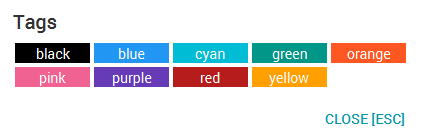

# μTask - User Guide

By : `Team W13-B1`  &nbsp;&nbsp;&nbsp;&nbsp; Since: `Jan 2017`  &nbsp;&nbsp;&nbsp;&nbsp; Licence: `MIT`

---

## Table of Contents

1. [Introduction](#1-introduction)
2. [Quick Start](#2-quick-start)  
	2.1.   [Installing](#21-installing) 
	2.2.   [Launching](#22-launching) 
	2.3.   [Using the Interface](#23-using-the-interface)
3. [Features](#3-features)  
	3.1.   [Viewing help : `help`](#31-viewing-help--help)  
	3.2.   [Setting save location: `setpath`](#32-setting-save-location-setpath)  
	3.3.   [Creating tag: `createtag`](#33-creating-tag-createtag)  
	3.4.   [Listing tags: `listtag`](#34-listing-tags-listtag)  
	3.5.   [Updating a tag: `updatetag`](#35-updating-a-tag-updatetag)  
	3.6.   [Deleting a tag: `deletetag`](#36-deleting-a-tag-deletetag)  
	3.7.   [Creating task: `create`](#37-creating-task-create)  
	3.8.   [Listing tasks: `list`](#38-listing-tasks-list)  
	3.9.   [Finding tasks by keywords: `find`](#39-finding-tasks-by-keywords-find)  
	3.10.   [Viewing a task: `select`](#310-viewing-a-task-select)  
	3.11.   [Updating a task: `update`](#311-updating-a-task-update)  
	3.12.   [Updating completed task: `done`](#312-updating-completed-task-done)  
	3.13.   [Updating uncompleted task: `undone`](#313-updating-uncompleted-task-undone)  
	3.14.   [Deleting a task: `delete`](#313-deleting-a-task-delete)  
	3.15.   [Clearing all entries : `clear`](#314-clearing-all-entries--clear)  
	3.16.   [Undoing previous actions: `undo`](#315-undoing-previous-actions-undo)  
	3.17.   [Redoing previous actions: `redo`](#316-redoing-previous-actions-redo)  
	3.18.   [Exiting the program : `exit`](#317-exiting-the-program--exit)  
	3.19.   [Saving the data](#318-saving-the-data) 
	3.19.   [Saving the data](#318-saving-the-data)
4. [FAQ](#4-faq)
5. [Commands Summary](#5-commands-summary)

----------

<!-- @@author Team-uTask -->
## 1. Introduction

Manage your tasks with just **1 line** of input from your keyboard.

Do you desire to create, retrieve, update and delete your tasks? **1 line** from μTask is all you need. 
Do you wish to search, sort, filter and label your tasks?  **1 line** from μTask is all you need.

In a cosmopolitan city like Singapore, majority of us live our day to day lives filled with an *endless list* consisting of *things to do*, *deadlines* and *events*. We, as developers, comprehend your difficulty in managing that list and wish to ease the process of task management for you.

Hence, that is the objective of μTask, our Task manager which processes your commands through *simple* keyboard inputs. μTask is swift, straightforward, and encompasses all of the features you require to manage your tasks.

Simply type in your command, and hit <kbd>Enter</kbd> to let μTask to do the heavy lifting for task management. Meanwhile you can focus your attention to other important matters at hand.
  

----------

<!-- @@author Team-uTask-->

## 2. Quick Start

### 2.1. Installing
1. Ensure you have Java version `1.8.0_60` or later installed in your Computer. 

   > Having any Java 8 version is not enough.  
   > This app will not work with earlier versions of Java 8.

2. Download the latest `uTask.jar` from the [releases](../../../releases) tab.
3. Copy `uTask.jar` to the folder you want to use as the home folder for your task management.

### 2.2. Launching

Double-click the file to start the app. The Graphic User Interface should appear in a few seconds.
    

### 2.3. Using the Interface

Type the command in the command box and press <kbd>Enter</kbd> to execute it.  
   e.g. typing **`help`** and pressing <kbd>Enter</kbd> will open the help window.

Some example commands you can try:

   * **`list`** : lists all task.
   * **`add`**`my first task` :
     adds a task named `my first task` to μTask.
   * **`delete`**` 3` : deletes the 3rd task shown in the current list.
   * **`exit`** : exits the application.

Refer to the [Features](#features) section below for details of each command. 

----------

## 3. Features

> **Command Format**
>
> * Words in `UPPER_CASE` are the parameters.
> * Items in `[SQUARE_BRACKETS]` are optional.
> * Items with `...` after them can have multiple instances.
> * Parameters can be in any order.

### 3.1 Viewing help : `help`

Displays a help menu to aid users in using μTask.  

Format: `help`

> Alternatively, you can hit the <kbd>F1</kbd> key to access the user guide.  
> Help is also shown if you enter an incorrect command e.g. `abcd` or simply type in <kbd>?</kbd> for suggested commands.  

### 3.2. Creating task: `create`

Creates a new task in μTask.  

Format: `create NAME [/by DEADLINE] [/from START_TIME to END_TIME] [/repeat FREQUENCY] [/tag TAG...]`

> *  `DEADLINE` uses`DDMMYY` format to represent date. Alternatively it also accepts simple words such as *today* or *tmr*.
> *  `START_TIME` and `END_TIME` uses a combination of  `HHMM` format to represent date and time
>    * `HHMM` is mandatory to indicate the start and the end time.

| Symbol | Meaning            | 
|--------|--------------------|
| HH     | hour of day (0~23) | 
| MM     | minute of hour     |
| DD     | day of year        |
| MM     | month of year      |
| YY     | year               |

> * Tasks can have any number of tags (including 0)

Examples:

* `create watch movie from me to you /from 1830 010317 to 010317 2030 `
* `create read essay by tutor /by 200217 /tag urgent /tag assignment`

### 3.3. Finding tasks by keywords: `find`

Finds tasks which contains any of the given keywords. 

Format: `find KEYWORD...`

> * `Find` searches across all existing attributes in Task.
> * The search is case sensitive. e.g `grocery` will not match `Grocery`
> * The order of the keywords does not matter. e.g. `Grocery Store` will match `Store Grocery`
> * Only full words will be matched e.g. `Gro` will not match `Grocery`
> * Tasks matching at least one keyword will be returned (i.e. `OR` search).
    e.g. `Grocery` will match `Store Grocery`

Examples:

* `find Buy` 
  Returns `Buy Grocery` but not `buy`
* `find Impt Clear John` 
  Returns Any tasks having descriptions `Impt`, `Clear`, or `John`

### 3.4. Updating a task: `update`

Updates an existing task in μTask. You can perform update on a specific task after `list` command has been executed.  

Format: `update INDEX [/name NAME] [/by DEADLINE] [/from START_TIME to END_TIME] [/repeat FREQUENCY] [/tag TAG...][/done YES|NO]`

> * Updates the task at the specified `INDEX`.
    The index refers to the index number shown after `find` command has been executed. 
> * At least one of the optional fields must be provided.
> * Existing values will be updated to the input values.
> * When updating tags, the existing tags of the task will be removed i.e adding of tags is not cumulative.
> * You can remove all the task tags by typing `/tag` without specifying any tags after it.

Examples:

* `update 1 /name do homework` 
  Updates the name of task at `index` 1 to "do homework".

* `update 2 /tag urgent` 
  Updates the tag of the task at `index` 2 to "urgent and removes all existing tags, if applicable.

### 3.5. Updating completed task: `done`

Updates the `status` of an existing task to `yes`.  

Format: `done INDEX`

> * Updates the task at the specified `INDEX`.
> * The index refers to the index number shown after `list` or `find` command has been executed. 

Examples:

* `done 1` 
  Updates the status of task at `index` 1 to done.

### 3.6. Updating uncompleted task: `undone`

Updates the `status` of an existing task to `no`.  

Format: `undone INDEX`

> * Updates the task at the specified `INDEX`.
> * The index refers to the index number shown after `list` or `find` command has been executed. 

Examples:

* `undone 1` 
  Updates the status of task at `index` 1 to undone.

### 3.7. Deleting a task: `delete`

Deletes the specified task from μTask.  

Format: `delete INDEX`

> * Deletes the task at the specified `INDEX`.  
> * The index refers to the index number shown on the retrieved listing after `list` or `find` command is used.  

Examples:

* `list` 
  `delete 2` 
  Deletes the 2nd task in μTask.

* `find terra` 
  `delete 1` 
  Deletes the 1st task in the results of the `find` command.

### 3.8. Clearing all entries : `clear`

Clears all stored tasks from the μTask. 

Format: `clear`

### 3.9. Selecting a task: `select`

Views specific task's details based on the given index provided.  

Format: `select INDEX or select last`

> * Views the task at the specified `INDEX`.
    The index refers to the index number shown after `list` or `find` command has been executed. 
> * `last` refers to the very last entry displayed by μTask

Examples:

* `select 1` 
  Displays in depth details of the task at `index` 1.

* `select last` 
  Displays in depth details of the task with the maximal `index`.

### 3.10. Undoing previous actions: `undo`

Reverts changes made within μTask based on the provided amount of `STEPS`.  

Format: `undo [/last STEPS]`

> * Based on the value of `STEPS` provided, μTask will undo the specified amount of times.  
> * If the provided `STEPS` is higher than the number of commands executed within the session, μTask will prompt for confirmation before losing all changes made.  

Examples:

* `undo /last 4` 
  Reverts last 4 commands executed within μTask.

### 3.11. Redoing previous actions: `redo`

Re-applies the changes reverted by undo within μTask based on the provided amount of `STEPS`.  

Format: `redo [/last STEPS]`

> * Based on the value of `STEPS` provided, μTask will redo the specified amount of times.  
> * If the provided `STEPS` is higher than the number of undo executed within the session, μTask will prompt for confirmation before re-applying all changes made.  

Examples:

* `redo /last 4` 
  Re-applies last 4 changes reverted by undo within μTask.

### 3.12. Creating tag: `createtag`

Creates a new tag in μTask.  

Format: `createtag NAME [/color COLOR]`

> * `NAME` provided must be unique and currently not existing in the μTask.
> * `COLOR` provided can come in a form of 6 digit hexadecimal `RRGGBB` or plain English.

| Symbol | Meaning            | Example        |
|--------|--------------------|----------------|
| RR     | Value of Red hue   | 08             |
| GG     | Value of Green hue | ff             |
| BB     | Value of Blue hue  | 8e             |

Examples:

* `createtag urgent /color dark red`
* `createtag low priority /color 00ffff`

### 3.13. Listing tags: `listtag`

Lists μTask's current database for all stored tags. 

Format: `listtag`
> * If no tags exists within the database, μTask will prompt and inform you.
> * μTask will list the tags according to the  chronological order of creation

Examples:
* `listtag`

### 3.14. Updating a tag: `updatetag`

Updates an existing tag in μTask.  

Format: `updatetag NAME [/name NAME] [/color COLOR]`

> * Updates the tag based on `NAME`.
> * `NAME` provided must be unique and currently not existing in the μTask.
> * The following table shows our supported colors for `COLOR`.
 

Examples:

* `updatetag School /name NUS /color orange` 
  Updates the `School` tag  to have `NUS` as name and `Orange` color.

* `updatetag Home /color blue` 
  Updates the `Home` tag to have `blue` as color.

### 3.15. Deleting a tag: `deletetag`

Deletes the specified tag from μTask. 

Format: `deletetag NAME`

> * Deletes the tag based on the specified `NAME`.  
> * All existing tasks affected will have the specific tag removed.

Examples:

* `deletetag School` 

### 3.16. Creating a command alias : `alias`

Creates an alias command for an existing command in μTask. 

Format: `alias ALIAS /as COMMAND`

> * `ALIAS`  must be a single word consisting of *alphabets* or *digits*. 
> * `COMMAND` must be a command which exists in μTask. 

Examples:

* `alias c /as create` 
  `c Homework to Do` 
  Creates a to-do task named "Homework to Do".

### 3.17. Viewing all command aliases: `listalias`

Lists all the command alias created in μTask. 

Format: `listalias`

> * If no command aliase exists within the database, μTask will prompt and inform you.
> * μTask will list the command alias according to the  chronological order of creation

Examples:

* `listalias` 

### 3.18. Deleting a command aliase: `unalias`

Delete an existing command alias in μTask. 

Format: `unalias ALIAS`

> * If `ALIAS` does not exists within the database, μTask will prompt and inform you.

Examples:

* `unalias c` 
Assuming *c* is a command aliase for create command, it will delete this alias.

### 3.19. Setting save location: `relocate`

Designates the save directory for μTask. Additionally, μTask data are saved in the hard disk automatically after any command that changes the data. 

Format: `relocate PATH`

> * `PATH` provided by the user has to be a valid folder for the command to execute successfully.  
> * There is no need to save manually.

Examples:

* `setpath C:\TEMP`

### 3.20. Exiting the program : `exit`

Exits the program. 

Format: `exit`

----------

## 4. FAQ

**Q**: How do I transfer my data to another Computer? 
**A**: Install the app in the other computer and overwrite the empty data file it creates with
       the file that contains the data of your previous μTask folder.

----------

## 5. Commands Summary

Command | Format
-------- | :--------
help | `help`
create | `create NAME [/by DEADLINE] [/from START_TIME to END_TIME] [/repeat FREQUENCY] [/tag TAG...]`
find | `find KEYWORD...`
update | `update INDEX [/name NAME] [/by DEADLINE] [/from START_TIME to END_TIME] [/repeat FREQUENCY] [/tag TAG...][/status COMPLETE|INCOMPLETE]`
done | `done INDEX`
delete | `delete INDEX,[INDEX],..` *or* `delete INDEX to INDEX`
clear | `clear`
select | `select INDEX`
undo | `undo [/last STEPS]`
redo | `redo [/last STEPS]`
createtag | `createtag NAME [/color COLOR]`
listtag | `listtag`
updatetag | `updatetag INDEX [/name NAME] [/color COLOR]`
deletetag | `deletetag INDEX`
alias | `alias ALIAS /as COMMAND`
listalias | `liastalias`
unalias | `unalias ALIAS`
setpath| `setpath PATH`
exit | `exit`

